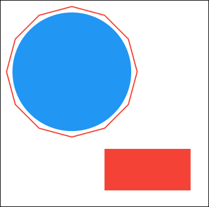
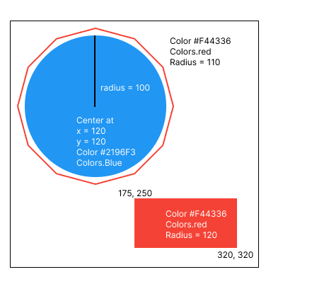

# Flutter Coding Challenge #2

Welcome to this Flutter coding challenge! This challenge will test your ability to use a custom
Painter.

## Environment

* Platform: **Web** (testing widgets only works with web rendering currently)
* Restrictions
    * Do not modify the `lib/main.dart` file
    * Leave the `lib/src/` folder untouched

## Coding Challenge Task

Your UI designer wants you to draw a custom and would like you to develop this button with flutter.
The
background should also have a gradient. Actually, everything has a gradient, even the border and the
icons.

You can also check out this Figma design
file: https://www.figma.com/design/qdGtCbNodBf39SzfmIz3M9/Servus-Flutter-Coding-Challenges?node-id=26-2&t=AFZQg7CylVAdVAzn-1

## Where to start?

* Edit the `lib/start_widget.dart` file. You can create additional files as needed.

## Testing and Submission:

Once you've completed the UI recreation, use the provided button to test your solution. If it
functions correctly, submit your code as the answer on the coding challenge
page:  https://www.servusflutter.com/challenges

## Additional Tips:

* Feel free to create as many helper files as needed to organize your code.
* Refer to the Flutter documentation (https://flutter.dev/docs) for assistance with building UIs.
* Good luck and have fun!

